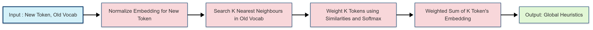
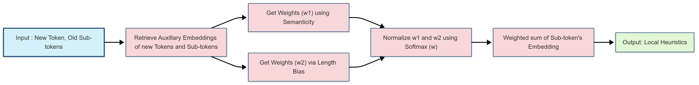

# TokenAdapt


TokenAdapt is a Tokenizer Transplantation Tool that allows users to seamlessly transplant tokenizers between language models while preserving semantic meaning. This tool is designed for users who want to adapt models for specific tasks or datasets without losing the integrity of the original embeddings, using intelligent 0-shot initialization heuristics.

### Global-Heuristic


### Local-Heuristic


## Installation

To get started, clone the repository and install the required dependencies:

```bash
# Clone the repository
git clone https://github.com/Tinycompany-AI/tokenadapt.git
cd tokenadapt

# Create and activate a virtual environment (recommended)
python -m venv venv
source venv/bin/activate  # On Windows: venv\Scripts\activate

# Install dependencies (CPU-based FAISS)
pip install torch transformers tqdm numpy faiss-cpu>=1.7.0
# Or install GPU-based FAISS if you have CUDA configured:
# pip install torch transformers tqdm numpy faiss-gpu>=1.7.0

# Alternatively, use the requirements file:
# pip install -r requirements.txt
```
*(See `requirements.txt` for specific versions)*

## Key Features

- 🔄 **Seamless Tokenizer Transplantation**: Easily transfer tokenizers between models.
- 🧠 **Intelligent Embedding Initialization**: Effective 0-shot initialization using a hybrid heuristic approach (local subword composition + global K-NN similarity).
- 🔗 **Support for Tied and Untied Embeddings**: Flexibility in handling different model architectures.
- 🚀 **Efficient Caching & Indexing**: Reduces computation time by caching external embeddings and using FAISS for efficient similarity search.
- 🎯 **Configurable Heuristics**: Adjust temperature and heuristic weighting.
- 🕒 **Optimized for Speed**: Batched embedding extraction and efficient indexing.

## Quick Start

To use the tool, run the following command with the required arguments:

```bash
python src/transplant.py \
    --model_path <original_model> \
    --new_tokenizer_path <new_tokenizer> \
    --new_model_name <output_model_name> \
    --hf_token <your_hf_token>
```

### Required Arguments

-   `--model_path`: Path or Hub ID of the original model.
-   `--new_tokenizer_path`: Path or Hub ID of the new tokenizer.
-   `--new_model_name`: HF Hub repository name for the output model (e.g., `your-username/your-model-name`).
-   `--hf_token`: Your Hugging Face authentication token (write permission needed).

### Optional Arguments & Heuristic Control

-   `--embedding_model_path` (default: `nomic-ai/nomic-embed-text-v2-moe`): External model used to generate embeddings for heuristic calculations (both local and global). Below are some recommended models
     - `jinaai/jina-embeddings-v3`
     - `BAAI/bge-m3`
     - <Works with any, Just plug and play>
-   `--temperature` (default: 0.3): Controls the sharpness of the softmax weighting in heuristics (0.01-1.0). Lower values yield more distinct weights, higher values produce flatter weights. (Experiments shows `0.18` , `0.24` or `0.45` ) works well too. 
-   `--top_k` (default: 3): Number of nearest neighbors (K) to consider for the global K-NN heuristic.
-   `--weight` (default: 0.3): Weight assigned to the global K-NN heuristic result (0.0-1.0). The local subword heuristic receives a weight of `(1 - weight)`. A weight of 0.0 disables K-NN, 1.0 disables the subword heuristic.
-   `--batch_size` (default: 16): Batch size for extracting embeddings with the external model.
-   `--multiple_of` (default: 128): Pad vocabulary size to a multiple of this value for potential throughput improvement.
-   `--dtype` (default: "fp32"): Data type for model loading and processing (`bf16`, `fp16`, `fp32`). Affects memory usage and computation speed.
-   `--threshold` (default: 0.0): Threshold for the similarity score between the original and new tokens. If the score is below the threshold, the global heuristic for that id will not be applied. Unintiutively the ppl of the model increases after applying this threshold.

## Example Usage

### Basic Usage

```bash
python src/transplant.py \
    --model_path "Qwen/Qwen2.5-3B-Instruct" \
    --new_tokenizer_path "fhai50032/QTK-81K" \
    --new_model_name "tinycompany/Qwentify" \
    --hf_token "hf_..."
```

### Advanced Usage with Custom Heuristic Settings

```bash
python src/transplant.py \
    --model_path "Qwen/Qwen2.5-3B-Instruct" \
    --new_tokenizer_path "fhai50032/QTK-81K" \
    --new_model_name "tinycompany/Qwentify" \
    --hf_token "hf_..." \
    --embedding_model_path "BAAI/bge-m3" \
    --temperature 0.24 \
    --top_k 2 \
    --weight 0.3 \
    --batch_size 16 \
    --multiple_of 128 \
    --dtype "bf16"
```

## License

This project is licensed under the Apache 2.0 License.

A detailed paper on the method will be available soon. You can find a summary on arXiv [here](https://arxiv.org/abs/2505.09738).

Copyright © 2025 IsNoobGrammer and aloobun

### Acknowledgements

We would like to thank [Tensoic](https://github.com/tensoic/) and [Google](https://github.com/AI-Hypercomputer) for providing compute resources for this project.
